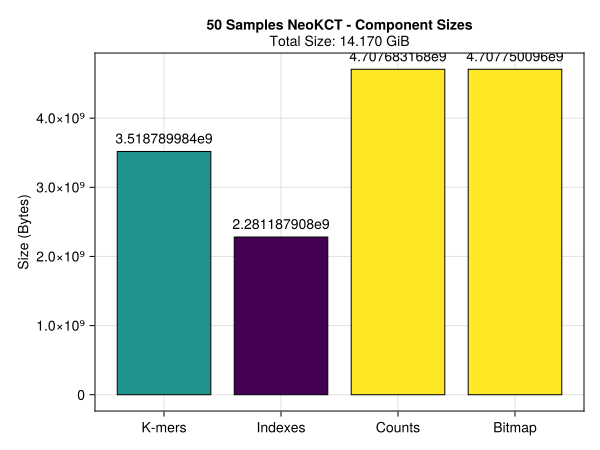
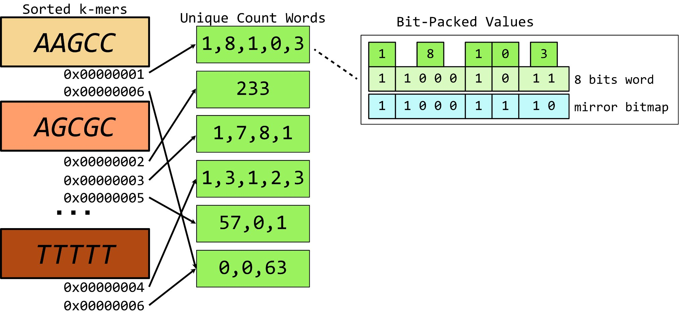
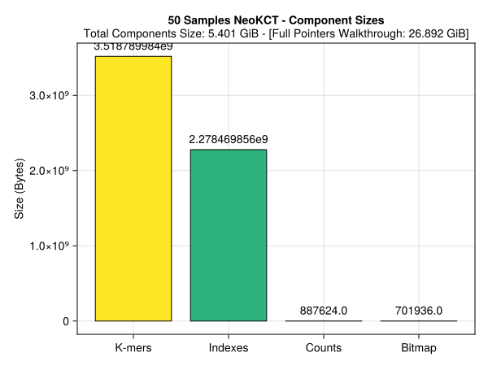
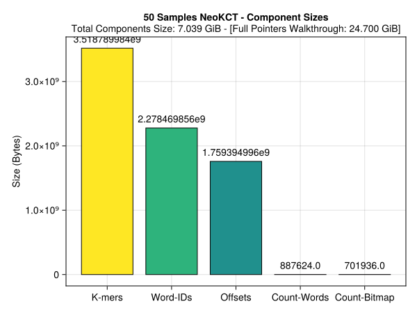
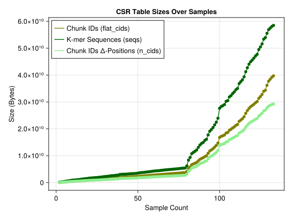
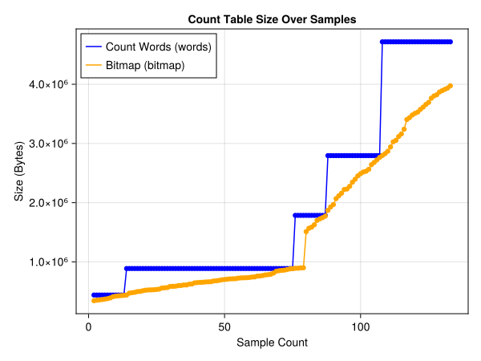
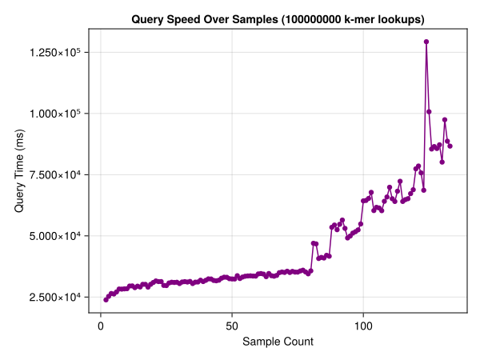
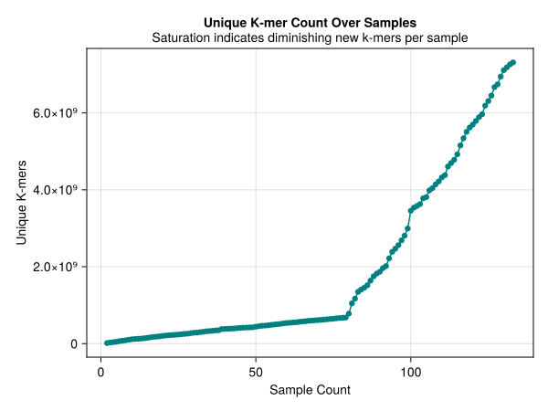
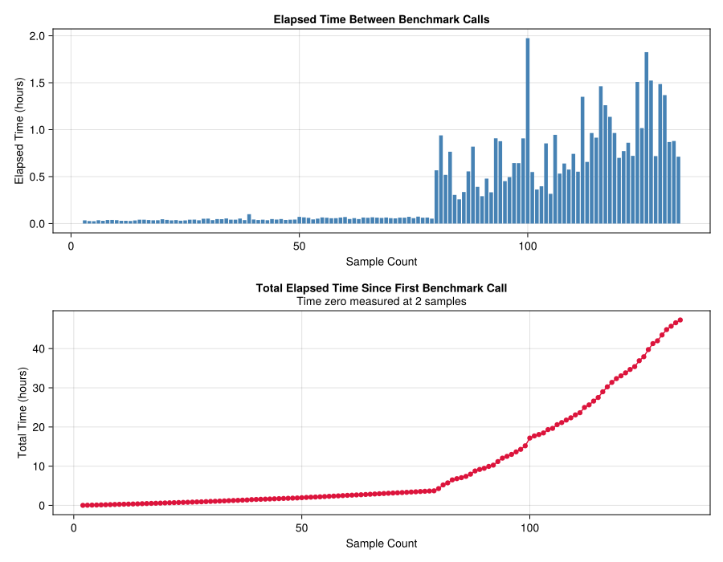

# K-mer Count Tables {background-color="#1a1a2e"}

Reference-free -omics at scale

---

## The Goal

Hold k-mer counts for as many TCGA + GTex samples as possible in a single table, then join against a mass-spec sequenced **aeTSA peptide table**.

. . .

:::: {.columns}

::: {.column width="50%"}
```
KCT (RNA-Seq, n samples)          aeTSA peptide table
┌────────────────────────────┐   ┌───────────────────┐
│ k-mer │ s1 │ s2 │ ... │ sn │   │ peptide │ source  │
│ MAEK  │  3 │  0 │ ... │  1 │   │ MAEKFW  │ sample1 │
│ AEKF  │  0 │  5 │ ... │  0 │   │ ...     │ ...     │
│ ...   │    │    │     │    │   └───────────────────┘
└────────────────────────────┘
          ↓  join on k-mer overlap
    per-sample expression of each candidate aeTSA
    across the full TCGA + GTex cohort
```
:::

::: {.column width="50%"}
TCGA + GTex is on the order of **thousands of samples**. Every save byte means more samples held on memory at the same time in the table.
:::

::::

---

## Pipeline

| Component | Role |
|---|---|
| `JelloFish.jl` | Multi-threaded FASTQ k-merization + parallel hash merge |
| `AAAlphabet.jl` | 5-bit AA alphabet, k-mers ≤12 AA fit in one `UInt64` |
| `PackedArray.jl` | Variable-width bit-packed count storage + boundary bitmap |
| `NeoKCT.jl` | K-mer-Count table + prefix-indexed binary search + `push!` logic |
| `KCTLoader.jl` | Versioned binary serialization, backward-compatible |
| `KCTBenchmarker.jl` | Component sizes, query speed, cardinality, elapsed time |

I went through a **major refactoring** of the KCT code to make it more maintainable, essentially catching up to a lot of "temporary solutions" to make the whole codebase more robust.
I also plan on abstracting JelloFish behind a standalone module.

---

# Version History {background-color="#16213e"}

---

## [V1.0](https://github.com/lemieux-lab/NeoKCT/tree/edd96dd73a8c0e2d0e75f8d62003fc8e5a4e0b43) · Baseline

```julia
# One heap object per k-mer
struct K_Element{K, Ab, C}
    seq::Kmer{Ab, K, C}  # Kmer struct: metadata + data
    chunk_ids::NTuple{N, UInt32}  # variable-length tuple: heap allocated
end

kct.table::Vector{K_Element}  # scattered across heap
```

Every k-mer lives at a different heap address. Iterating the table = pointer chasing.  
Serialization had to write type metadata per entry.

. . .

Worse: bugs caused words to not be deduplicated:

- My `collapse!` function doesn't really work in place. The `!` is there to warn that it makes
the "in-place" kct unusable. This caused it to not properly apply
- Words didn't properly "fork" when two k-mers point at them and a value is added to one, duplicating values inside of words

---

## [V1.0](https://github.com/lemieux-lab/NeoKCT/tree/edd96dd73a8c0e2d0e75f8d62003fc8e5a4e0b43) · Component Sizes at 50 Samples



> `Counts` dominates: mostly wasted words from duplication.

---

## [V1.1](https://github.com/lemieux-lab/NeoKCT/tree/80217932658bd9961a5f90ad084b6acbc1e1b26f) · Fix PackedArray Correctness

```julia
function Base.push!(kct::NeoKCT{K, Ab, W}, sample_hashtable::Dict{UInt64, UInt32}; collapse::Bool=false) where {K, Ab<:Alphabet, W<:Unsigned}
    @showprogress desc="Adding Sample $(kct.samples.x+1) to Table..." for (k_bits, count) in sample_hashtable
        tmp_seq = Kmer{Ab, K, 1}(Kmers.unsafe, (k_bits,))
        k_pos = findfirst(kct, tmp_seq)

        word_id = 0::Int
        if k_pos == 0
            word_id = _push_new_kmer_counts!(kct.counts, kct.samples.x, count)

            ke = K_Element{K, Ab}(tmp_seq, NTuple{1, UInt32}(UInt32(word_id)))
            push!(kct.table, ke)
        else
            word_id = push!(kct.counts, UInt64(count), kct.table[k_pos].chunk_ids[end])

            if kct.table[k_pos].chunk_ids[end] != UInt32(word_id)
                kct.table[k_pos] = K_Element{K, Ab}(kct.table[k_pos].seq, push(kct.table[k_pos].chunk_ids, UInt32(word_id)))
            end
        end
    end

    sort!(kct)
    compute_index!(kct)
    kct = collapse ? collapse!(kct) : kct
    kct.samples.x += 1
    return kct
end

function build_kct(samples::AbstractVector{String}, K::Int=30, chunks::Int = 500_000; save_at_samples::AbstractVector{Int}=Int[], save_path::String = "", collapse_every::Int=1)
    kct = NeoKCT{K÷3, AAAlphabet, UInt64}(jello_superthreaded_hash(popfirst!(samples), K, chunks))
    for (i, sample) in enumerate(samples)
        sample_hashtable = jello_superthreaded_hash(sample, K, chunks)
        push!(kct, sample_hashtable, collapse = (i+1) % collapse_every == 0)
        i+1 in save_at_samples && save(kct, save_path*"$(day(now()))_$(month(now()))_$(year(now()))_$(i+1)samples__neokct.kct")
    end
    return kct
end
```
`collapse!` here does create a new collapsed kct that's returned... But never caught because `push!` is assumed to work in place (which it does, except for that...)

---

## [V1.1](https://github.com/lemieux-lab/NeoKCT/tree/80217932658bd9961a5f90ad084b6acbc1e1b26f) · Result

::: {.columns}
::: {.column width="30%"}
Once fixed, packing density matches theory:  
~8-20 small counts per `UInt128` word for 50 to 100 samples.

The count table went from dominant cost to basically a **rounding error** thanks to bitpacking & word-dedupplication.
:::
::: {.column  width="70%"}
Reminder:


:::
:::

---

## [V1.1](https://github.com/lemieux-lab/NeoKCT/tree/80217932658bd9961a5f90ad084b6acbc1e1b26f) · Component Sizes at 50 Samples



> Count table collapsed. `K-mer Sequences & Chunk Indexes now dominate. This is a huge advancement from previous tables!

---

## [V1.2](https://github.com/lemieux-lab/NeoKCT/tree/be421db7dd7052bfd41cdf6348f1bfab4d9f3363) · CSR Layout {auto-animate=true}

`Vector{K_Element}` decomposed into flat parallel arrays: same layout as a sparse matrix CSR (Yale Format):

```julia
# [V1.0](https://github.com/lemieux-lab/NeoKCT/tree/edd96dd73a8c0e2d0e75f8d62003fc8e5a4e0b43)
kct.table::Vector{K_Element}  # heap-scattered objects, pointer per k-mer

# [V1.2](https://github.com/lemieux-lab/NeoKCT/tree/be421db7dd7052bfd41cdf6348f1bfab4d9f3363)
struct NeoKCT{K, Ab, W, C}
    seqs::Vector{UInt64}  # sorted k-mer bit-representations: contiguous
    offsets::Vector{UInt32}  # offsets[i] = start of k-mer i's CIDs in flat_cids
    flat_cids::Vector{UInt32}  # all PackedArray word IDs, concatenated
    counts::PackedArray{UInt32, W}
    # ...
end
```

---

## [V1.2](https://github.com/lemieux-lab/NeoKCT/tree/be421db7dd7052bfd41cdf6348f1bfab4d9f3363) · CSR Layout {auto-animate=true}

```julia
struct NeoKCT{K, Ab, W, C}
    seqs::Vector{UInt64}  # sorted k-mer bit-representations: contiguous
    offsets::Vector{UInt32}  # offsets[i] = start of k-mer i's CIDs in flat_cids
    flat_cids::Vector{UInt32}  # all PackedArray word IDs, concatenated
    counts::PackedArray{UInt32, W}
    # ...
end
```

Everything lives on the **stack** (as flat vectors with known sizes).  
Avoiding the heap saves on pointer cost, build, write & load times, and make the garbage collector hate me less.

| | [V1.0](https://github.com/lemieux-lab/NeoKCT/tree/edd96dd73a8c0e2d0e75f8d62003fc8e5a4e0b43) | [V1.2](https://github.com/lemieux-lab/NeoKCT/tree/be421db7dd7052bfd41cdf6348f1bfab4d9f3363) |
|---|---|---|
| Memory layout | Heap-scattered | Contiguous flat vectors |
| Full pointer walkthrough | O(n_kmers) pointer chases | Bounded: `sizeof` each array |
| Disk write | Per-entry metadata + data | Bulk `write(io, vec)` per array |
| Build time (100 samples) | ~36 hours | ~19.5 hours |
| Load time (100 samples) | ~20 min | ~30 sec |

---

## [V1.2](https://github.com/lemieux-lab/NeoKCT/tree/be421db7dd7052bfd41cdf6348f1bfab4d9f3363) · How CSR lookup works

```julia
# To get the chunk IDs for k-mer at position i:
lo = offsets[i]
hi = offsets[i+1] - 1
cids = flat_cids[lo:hi]  # all PackedArray word IDs for this k-mer

# To reconstruct its count vector across samples:
counts = reduce(vcat, [assemble_word(kct.counts, Int(c)) for c in cids])
```

Offset array is the only indirection. Everything else is a direct slice into a flat vector.

---

## [V1.2](https://github.com/lemieux-lab/NeoKCT/tree/be421db7dd7052bfd41cdf6348f1bfab4d9f3363) · Prefix-Indexed Binary Search

Predates [V1.2](https://github.com/lemieux-lab/NeoKCT/tree/be421db7dd7052bfd41cdf6348f1bfab4d9f3363), but worth showing again in its latest form.

```julia
function Base.findfirst(kct::NeoKCT{K, Ab}, key::Kmer{Ab, K}) where {K, Ab}
    # Extract the 4-AA prefix (20 bits) to index into pre-computed bucket ranges
    idx_key = key.data[1] >> (idx_prefix_size(kct) * bits_per_symbol(Ab())) + 1
    r = kct.idx[2][idx_key]  # UnitRange{Int64}: start:stop for this bucket
    i = searchsortedfirst(kct.seqs, key.data[1], r.start, r.stop, Base.Forward)
    return (i in r) && kct.seqs[i] == key.data[1] ? i : 0
end
```

~160,000 buckets (4^5 AA prefix combinations) → each bucket covers ~1/160,000th of the table.  
Lookup is **O(log(n_kmers / 160,000))**. With [V1.2](https://github.com/lemieux-lab/NeoKCT/tree/be421db7dd7052bfd41cdf6348f1bfab4d9f3363), we have a lookup time of **1.67e7 k-mers per second** for 100 samples (3.5 billion unique k-mers)

> **Note:** the index itself is a fixed `fill(0:-1, 4^15)`. ~16 GB constant overhead, always present regardless of table size.

---

## [V1.2](https://github.com/lemieux-lab/NeoKCT/tree/be421db7dd7052bfd41cdf6348f1bfab4d9f3363) · push! (before refactor)

```julia
# Simplified: old logic was flat and mixed concerns of words not forking correctly
function Base.push!(kct::NeoKCT, sample_hashtable::Dict{UInt64, UInt32})
    shared_words = find_shared_words(kct)   # O(n_flat_cids) scan every push
    for (k_bits, count) in sample_hashtable
        k_pos = findfirst(kct, ...)
        if k_pos == 0
            # inline: push new word to counts, append to seqs/flat_cids/n_cids
        else
            # inline: check shared words, fill missing samples, append CID
        end
    end
    sort!(kct)  # full re-sort of all arrays
end
```

New k-mers and existing k-mers handled inline, sort done unconditionally at the end.

---

## [V1.2](https://github.com/lemieux-lab/NeoKCT/tree/be421db7dd7052bfd41cdf6348f1bfab4d9f3363) · Component Sizes at 50 Samples



> `Indexes` (offsets) now visible. `seqs` + `flat_cids` are the bulk. But offsets have a scaling problem.
What happens when the numbre of words goes above `typemax(UInt32)`?

---

## [V1.3](https://github.com/lemieux-lab/NeoKCT/tree/af71d363f91623e3e6ea515da0cc07e66097476a) · CID Count Encoding {auto-animate=true}

`offsets` stores absolute positions into `flat_cids`:

```julia
offsets::Vector{UInt32}  # length n_kmers+1
                         # overflows at ~4B total CIDs
                         # derivable from flat_cids anyway
```

---

## [V1.3](https://github.com/lemieux-lab/NeoKCT/tree/af71d363f91623e3e6ea515da0cc07e66097476a) · CID Count Encoding {auto-animate=true}

Replace with per-k-mer CID count. Recover offsets on the fly via cumsum:

```julia
n_cids::Vector{UInt16}   # length n_kmers -- 2 bytes vs 4
                         # UInt16 max = 65535 CIDs/k-mer, well above any realistic count

# Offset for k-mer i:
lo = 1 + sum(@view kct.n_cids[1:i-1])  # computed on demand, not stored
```

| | `offsets` ([V1.2](https://github.com/lemieux-lab/NeoKCT/tree/be421db7dd7052bfd41cdf6348f1bfab4d9f3363)) | `n_cids` ([V1.3](https://github.com/lemieux-lab/NeoKCT/tree/af71d363f91623e3e6ea515da0cc07e66097476a)) |
|---|---|---|
| Type | `UInt32` | `UInt16` |
| Length | `n_kmers + 1` | `n_kmers` |
| Bytes/k-mer | 4 | 2 |
| Overflow risk | Yes (~4B CIDs) | No |
| [V1.2](https://github.com/lemieux-lab/NeoKCT/tree/be421db7dd7052bfd41cdf6348f1bfab4d9f3363) compat | -- | `n_cids = UInt16.(diff(offsets))` |

---

## [V1.3](https://github.com/lemieux-lab/NeoKCT/tree/af71d363f91623e3e6ea515da0cc07e66097476a) · CID Count Encoding {auto-animate=true}

Replace with per-k-mer CID count. Recover offsets on the fly via cumsum:

```julia
n_cids::Vector{UInt16}   # length n_kmers -- 2 bytes vs 4
                         # UInt16 max = 65535 CIDs/k-mer, well above any realistic count

# Offset for k-mer i:
lo = 1 + sum(@view kct.n_cids[1:i-1])  # computed on demand, not stored
```

> **Concern**: Then isn't finding a k-mer's count slower?

*Doing cumulative sums in julia is actually extremely fast. At 100 samples, our lookup speed is virtually the same at 1.56e7 k-mers per second.*

---

## [V1.3](https://github.com/lemieux-lab/NeoKCT/tree/af71d363f91623e3e6ea515da0cc07e66097476a) · push! Refactor

Old flat logic split into three clearly scoped private functions:

```julia
function Base.push!(kct::NeoKCT, sample_hashtable::Dict{UInt64, UInt32})
    shared_words = find_shared_words(kct)
    offsets = _kmer_offsets(kct.n_cids)  # O(n_kmers), computed once
    ext_buf = Dict{Int, Vector{UInt32}}()  # buffer new CIDs for existing k-mers
    new_seqs = UInt64[]
    new_cids = Vector{UInt32}[]

    for (k_bits, count) in sample_hashtable
        k_pos = findfirst(kct, ...)
        if k_pos == 0
            push!(new_seqs, k_bits)
            push!(new_cids, _push_new_kmer_counts!(kct.counts, kct.samples.x, count))
        else
            _push_existing_kmer_counts!(kct, ext_buf, k_pos, shared_words, count, offsets)
        end
    end
    _merge_and_sort!(kct, ext_buf, new_seqs, new_cids, offsets)
end
```

`ext_buf` collects new CIDs for existing k-mers during the scan.  
`_merge_and_sort!` does a single parallel merge-sort pass at the end via `psortperm`.

---

## [V1.3](https://github.com/lemieux-lab/NeoKCT/tree/af71d363f91623e3e6ea515da0cc07e66097476a) · `_push_new_kmer_counts!`

```julia
# k-mer seen for the first time: backfill zeros for all previous samples, then add count
function _push_new_kmer_counts!(counts::PackedArray{UInt32, W}, prev_samples::Int, count::UInt32) where {W}
    wid = new_word!(counts)
    chunk_ids = UInt32[wid]
    for _ in 1:prev_samples  # fill missing sample slots with 0
        new_wid = push!(counts, W(0), wid)
        if new_wid != wid
            push!(chunk_ids, UInt32(new_wid))
            wid = new_wid
        end
    end
    new_wid = push!(counts, W(count & typemax(W)), wid)
    new_wid != wid && push!(chunk_ids, UInt32(new_wid))
    return chunk_ids
end
```

Returns the vector of `PackedArray` word IDs for this k-mer, appended directly to `flat_cids`.
Note that we don't store "trailing" zeros, they are assumed and retrieved from sample count.

---

## [V1.3](https://github.com/lemieux-lab/NeoKCT/tree/af71d363f91623e3e6ea515da0cc07e66097476a) · Component Sizes at 50 Samples


> K-mer sequences are the biggest factor of the table, and now that the CSR cannot overflow, we're set to tackle that problem next.

---

## [V1.3](https://github.com/lemieux-lab/NeoKCT/tree/af71d363f91623e3e6ea515da0cc07e66097476a) · Growth Over Samples

:::: {.columns}

::: {.column width="50%"}
**CSR Table**



Note that at 80 samples we switch to OV files that are much bigger
:::

::: {.column width="50%"}
**Count Table**



Expected a more sub-linear growth of k-mers (even before the switch to OV cancer files)
:::

::::

---

## [V1.3](https://github.com/lemieux-lab/NeoKCT/tree/af71d363f91623e3e6ea515da0cc07e66097476a) · Query Speed + K-mer Cardinality

:::: {.columns}

::: {.column width="50%"}
**Query Speed**



Growth that somewhat follows the growth of k-mers in the table.
:::

::: {.column width="50%"}
**K-mer Cardinality**



Expected a more sub-linear growth of k-mers (even before the switch to OV cancer files)
:::

::::

---

## [V1.3](https://github.com/lemieux-lab/NeoKCT/tree/af71d363f91623e3e6ea515da0cc07e66097476a) · Elapsed Time



Time to build is still substantial, but GC time is now static ~2% instead of a growing amount of time due to the heap mess.

---

# Lab Ecosystem Updates {background-color="#0f3460"}

LabRegistry · Slurm Utils

---

## LabRegistry

`lemieux-lab/LabRegistry` two packages now registered:

:::: {.columns}

::: {.column width="50%"}
**NMacros** macro-based CairoMakie plotting

```julia
fig = @nscatter n_x [n_sin, n_cos] begin
    n_x   = range(0, 2π, length=100)
    n_sin = sin.(n_x)
    n_cos = cos.(n_x)
end
```

`@nscatter` `@nlines` `@nhist`  
`@nboxplot` `@nheatmap` `@nhexbin`
:::

::: {.column width="50%"}
**Dabus** Flux.jl network visualizer

```julia
draw_network(
    Chain(Dense(50, 10, relu), Dense(10, 1)),
    save_to="network.png"
)
```

`Dense` `Conv` `LSTM` `Parallel`  
`SkipConnection` `MultiHeadAttention`  
No local GraphViz needed.
:::

::::

---

## LabRegistry · Setup

```bash
export JULIA_PKG_USE_CLI_GIT=true  # + SSH key on GitHub
```

```julia
registry add git@github.com:lemieux-lab/LabRegistry.git
] add NMacros   # or Dabus
```

. . .

> **JuBox is deprecated.** Migrate now if you depend on it.

---

## Slurm Utils

Sent to Patrick -- will be cluster-wide once deployed.

:::: {.columns}

::: {.column width="55%"}
```bash
# Preset submission
micro_sbatch  job python analyze.py   # 2 CPU,  25G
kilo_sbatch   job ./train.sh          # 10 CPU, 50G
mega_sbatch   job nextflow run nf     # 20 CPU, 100G
giga_sbatch   job ./pipeline.sh       # 50 CPU, 500G
tera_sbatch   job ./huge_job.sh       # 100 CPU, 1TB

# Custom
var_sbatch job 48 384G bwa mem ref.fa reads.fastq
```
:::

::: {.column width="45%"}
```bash
# Logs
slog my_job     # view latest log
sarchive        # archive finished
sclear          # delete finished

# Config
semail me@lab.ca
sp_add nano 1 8G
sp_remove nano
sp              # list presets
shelp           # full reference
```
:::

::::

---

## What's Next

| | Detail |
|---|---|
| **Delta-encoded `seqs`** | `seqs` is sorted, so consecutive entries are close in value. Storing deltas instead of full `UInt64` should compress substantially. In progress |
| **Full cohort benchmarks** | [V1.3](https://github.com/lemieux-lab/NeoKCT/tree/af71d363f91623e3e6ea515da0cc07e66097476a) on TCGA + GTex |
| **Peptide join** | Connect KCT output to aeTSA discovery pipeline |

---

# Questions? {background-color="#1a1a2e"}

`github.com/lemieux-lab/NeoKCT`
