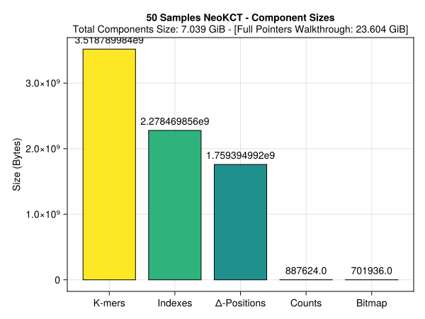
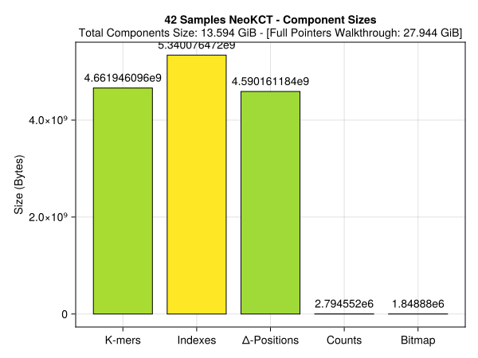
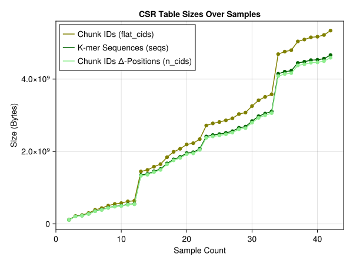
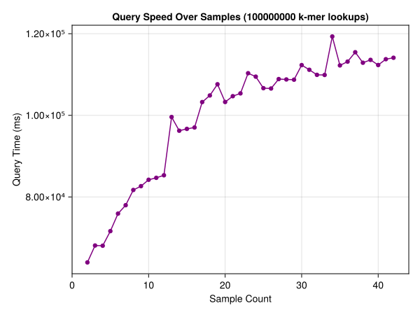
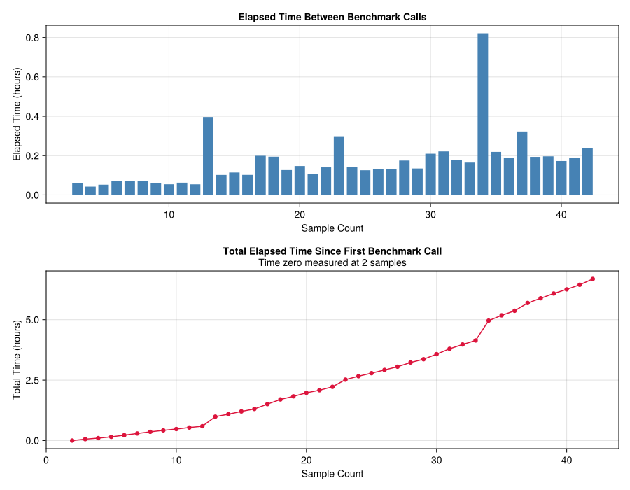

# V1.4 · Delta-Encoded K-mer Sequences {background-color="#1a1a2e"}

NeoKCT Progress · May 2026

---

## Recap: Where V1.3 Stood

At the last update, the table decomposed into 5 flat arrays (CSR layout):

```julia
struct NeoKCT{K, Ab, C}
    seqs::Vector{UInt64}       # sorted k-mer bit-reps : 8 bytes × n_kmers
    n_cids::Vector{UInt16}     # CID count per k-mer   : 2 bytes × n_kmers
    flat_cids::Vector{UInt32}  # all PackedArray word IDs
    counts::PackedArray{UInt32, W}
    idx::Pair{...}             # prefix index
end
```

`seqs` and `flat_cids` dominated. Count table was negligible.
`seqs` was the clear main target: one `UInt64` (8 bytes) per k-mer, no redundancy removal.

---

## V1.3 Component Sizes at 50 Samples (recap)



> `K-mer Sequences` dominates. Next target was explicit: compress `seqs`.

---

## The Idea

`seqs` is always **sorted**. That means consecutive entries are close in value.

. . .

```
Hypothetical sorted k-mers (as UInt64 bit-reps, 50-bit AA space):
index   value              delta
  1     0x0000001A3C40     :
  2     0x0000001A3C43     3
  3     0x0000001A3C4D     10
  4     0x0000001A3C4E     1
  ...
  k     0x0001000A0000     4,294,970,368  → overflow! → checkpoint
```

. . .

Instead of storing 8-byte absolute values, store **4-byte deltas** (`UInt32`).
When a delta would overflow `typemax(UInt32)`, fall back to a **checkpoint** (full `UInt64`).
Periodic checkpoints every 256 elements keep random access bounded to O(256).

---

## DeltaArray · The Struct {auto-animate=true}

```julia
struct DeltaArray{C, D} <: AbstractVector{C}
    checkpoints::Vector{C}          # absolute values: regular + overflow checkpoints
    deltas::Vector{D}               # D = UInt32; 0 is the sentinel "use next checkpoint"
    regular_cp_idx::Vector{UInt64}  # regular_cp_idx[k] → index in checkpoints for block k
    checkpoint_interval::Int        # default: 256
end
```

Two types of checkpoints:

| Type | When | Frequency |
|---|---|---|
| **Regular** | every `checkpoint_interval` elements | `n_kmers / 256` |
| **Overflow** | when `arr[i] - arr[i-1] > typemax(D)` | 0.00069% of k-mers in practice |

`delta[i] == 0` is the sentinel: _"this position has a checkpoint, not a delta."_

---

## DeltaArray · Encoding {auto-animate=true}

```julia
function _delta_encode(arr::Vector{C}, inter::Int, ::Type{D}=UInt32) where {C, D}
    checkpoints = C[]; deltas = zeros(D, length(arr))
    regular_cp_idx = Vector{UInt64}(undef, cld(length(arr), inter))

    for i in eachindex(arr)
        is_regular = (i - 1) % inter == 0
        overflow   = i > 1 && (arr[i] - arr[i-1]) > typemax(D)

        if is_regular || overflow
            is_regular && (regular_cp_idx[(i-1) ÷ inter + 1] = length(checkpoints) + 1)
            push!(checkpoints, arr[i])
            deltas[i] = D(0)              # sentinel
        else
            deltas[i] = D(arr[i] - arr[i-1])
        end
    end
    return checkpoints, deltas, regular_cp_idx
end
```

- `regular_cp_idx[k]` maps block `k` → its start in `checkpoints` (skipping over overflow CPs in between)
- Overflow CPs are interspersed in `checkpoints` but absent from `regular_cp_idx`
- Re-encoding after sort/merge: `encode!(a::DeltaArray, arr::Vector{C})`

---

## DeltaArray · Access Patterns

**Sequential iteration** : O(1) amortized; state carries `(index, cp_index, current_value)`:

```julia
function Base.iterate(a::DeltaArray{C}, state=(1, 0, C(0))) where {C}
    i, cp, v = state
    i > length(a) && return nothing
    if a.deltas[i] == 0
        cp += 1; v = a.checkpoints[cp]  # sentinel: jump to checkpoint
    else
        v += a.deltas[i]                # accumulate delta
    end
    return v, (i + 1, cp, v)
end
```

. . .

**Random access** : O(`checkpoint_interval`) worst case:

```julia
function Base.getindex(a::DeltaArray{C}, i::Integer)::C where {C}
    k  = (i - 1) ÷ a.checkpoint_interval
    cp = a.regular_cp_idx[k + 1]
    v  = a.checkpoints[cp]
    for j in (k * a.checkpoint_interval + 2):i
        a.deltas[j] == 0 ? (cp += 1; v = a.checkpoints[cp]) : (v += a.deltas[j])
    end
    return v
end
```

---

## DeltaArray · Sorted Search

`findfirst` previously called `searchsortedfirst` on the flat `Vector{UInt64}`.
Now calls `searchfirst` : a forward scan from the block's regular checkpoint:

```julia
function searchfirst(a::DeltaArray{C}, target::C, lo::Int, hi::Int)::Int where {C}
    k  = (lo - 1) ÷ a.checkpoint_interval
    cp = a.regular_cp_idx[k + 1]
    v  = a.checkpoints[cp]
    chunk_start = k * a.checkpoint_interval + 1

    for j in chunk_start:hi
        if j > chunk_start
            a.deltas[j] == 0 ? (cp += 1; v = a.checkpoints[cp]) : (v += a.deltas[j])
        end
        j < lo && continue
        v == target && return j
        v > target  && return 0   # sorted: past target, not found
    end
    return 0
end
```

The prefix index (160,000 buckets) narrows `[lo, hi]` to `~n_kmers / 160,000` entries :
so `checkpoint_interval = 256` overhead within that window is negligible.

---

## NeoKCT · Integration

`seqs` field type changes; everything else is interface-compatible:

```julia
struct NeoKCT{K, Ab<:Alphabet, C}
    seqs::DeltaArray           # was Vector{UInt64}
    n_cids::Vector{UInt16}
    flat_cids::Vector{UInt32}
    counts::PackedArray{UInt32}
    idx::Pair{Base.RefValue{Int64}, Vector{UnitRange{Int64}}}
    samples::Base.RefValue{Int64}
    version::Float64
end
```

| Function | Change |
|---|---|
| `findfirst` | `searchsortedfirst(kct.seqs, ...)` → `searchfirst(kct.seqs, ...)` |
| `compute_index!` | Uses `enumerate(kct.seqs)` : O(1) amortised via iterator |
| `_merge_and_sort!` | Calls `encode!(kct.seqs, all_seqs[perm])` after merge |
| `sort!` | `encode!(kct.seqs, seqs[perm])` instead of direct vector copy |

---

## Refactoring · AbstractVector Interface

Both `PackedArray` and `DeltaArray` now subtype `AbstractVector`, giving them a clean, reusable Julia interface:

```julia
struct DeltaArray{C, D} <: AbstractVector{C}   # getindex returns C
struct PackedArray{T, W} <: AbstractVector{T}   # getindex returns T
```

They can be passed wherever a vector is expected, iterated with `for`/`enumerate`, and indexed with `[]` : without the caller knowing about internal encoding.

. . .

As part of this cleanup, `word_size` was removed as a type parameter and promoted to a constructor keyword:

```julia
# V1.3 : word type baked into the type signature
kct = NeoKCT{K÷3, AAAlphabet, UInt128}(...)

# V1.4 : consistent constructor kwargs across both data structures
kct = NeoKCT{K÷3, AAAlphabet}(
    word_size       = UInt128,   # PackedArray word type
    checkpoint_size = UInt64,    # DeltaArray checkpoint element type
    delta_size      = UInt32,    # DeltaArray delta element type
)
```

---

## Results · V1.4 at 42 TCGA Samples

:::: {.columns}
::: {.column width="50%"}
**Component Sizes**


:::
::: {.column width="50%"}
**Key numbers at 42 samples : 1.15B k-mers**

| Component | Size |
|---|---|
| K-mer Sequences (`seqs`) | **4.66 GB** |
| ↳ Deltas (`UInt32 × n_kmers`) | 4.59 GB |
| ↳ Checkpoints (UInt64) | 35.9 MB |
| ↳ Checkpoint index (UInt64) | 35.9 MB |
| Chunk IDs (`flat_cids`) | **5.34 GB** |
| Δ-Positions (`n_cids`)* | 2.29 GB actual |
| Count words | 2.79 MB |
| Bitmap | 1.85 MB |

 _* I just noticed KCTBenchmarker.jl uses `sizeof(UInt32)` instead of `sizeof(UInt16)` meaning it reports 2× the real value._
:::
::::

---

## Results · The ~2× Compression

1,147,540,296 k-mers at 42 TCGA samples:

| Layout | Formula | Total |
|---|---|---|
| `Vector{UInt64}` (V1.3) | 1,147,540,296 × 8 B | **9.18 GB** |
| `DeltaArray{UInt64, UInt32}` (V1.4) | deltas + checkpoints + cp_idx | **4.66 GB** |
| **Savings** | | **4.52 GB · 1.97× compression** |

. . .

**Why almost exactly 2×?**

`deltas::Vector{UInt32}` : `n_kmers` elements at 4 bytes = exactly `4 × n_kmers`.
Checkpoints add ~72 MB total : 0.063 bytes/k-mer, negligible at this scale.

> **0.00069% overflow rate** : 7,955 overflow checkpoints at 42 samples, all corresponding
> to structural gaps in the 5-bit AA encoding that are permanently present regardless of sample count.
>
> More importantly: overflow checkpoints **stop being introduced entirely** at ~15 samples (~400M k-mers).
> Once the k-mer space is dense enough, every consecutive pair in sorted order fits within `UInt32`.
> This raises the question: could `UInt16` (2 bytes) work instead, halving delta memory again?
> The ~7,955 structural gaps would still need checkpoints either way : but the other 99.999% of deltas
> would shrink from 4 bytes to 2. This needs more testing before committing.

---

## Results · Bottleneck Has Shifted

`seqs` compression worked. `flat_cids` now leads : but the overall table is small enough to matter.

**DeltaArray sub-components at 42 samples:**

| Sub-component | Type | Size | Share of `seqs` |
|---|---|---|---|
| `deltas` | `Vector{UInt32}` | **4.59 GB** | 98.5% |
| `checkpoints` | `Vector{UInt64}` | 35.9 MB | 0.77% |
| `regular_cp_idx` | `Vector{UInt64}` | 35.9 MB | 0.77% |
| **Total `seqs`** | | **4.66 GB** | |

**Full table at 42 samples:**

```
V1.3 layout:  seqs ≫ flat_cids > n_cids ≫ counts
V1.4 layout:  flat_cids (5.34 GB) > seqs (4.66 GB) > n_cids (2.29 GB) ≫ counts (2.79 MB)
```

`flat_cids` is the next candidate for compression (per-k-mer CID lists are monotone).
But first : let's actually use this table.

---

## Results · Growth & Speed

:::: {.columns}
::: {.column width="50%"}
**CSR Table Growth**



`flat_cids` now grows faster than `seqs`.
:::
::: {.column width="50%"}
**Query Speed** (100M random lookups from checkpoints)



`searchfirst` on DeltaArray is **not measurably slower** than `searchsortedfirst` on a flat array : the prefix index already limits the search to a tiny window.
:::
::::

---

## Results · Build Time



42 samples built cleanly. OV (ovarian) cancer files are larger → occasional per-sample spikes.
GC time remains static : heap pressure is low with the flat vector layout.

---

## Serialization · V1.4 Binary Format

The V1.4 writer dumps DeltaArray components directly (no decode on load):

```julia
write(io, Int64(kct.seqs.checkpoint_interval))
write(io, Int64(length(kct.seqs.checkpoints)))
write(io, Int64(length(kct.seqs.regular_cp_idx)))
write(io, kct.seqs.checkpoints)           # bulk: Vector{UInt64}
write(io, kct.seqs.deltas)                # bulk: Vector{UInt32}
write(io, Int64.(kct.seqs.regular_cp_idx))
```

Backward compatibility: **V1.2 and V1.3 files still load** : the loader reads the flat `seqs`,
delta-encodes on the fly, and returns a V1.4 `NeoKCT`:

```julia
function load(io::IO, ::Val{1.3})
    raw_seqs = Vector{UInt64}(undef, n_kmers); read!(io, raw_seqs)
    # ...
    seqs = DeltaArray(raw_seqs, DEFAULT_CHECKPOINT_INTERVAL)  # encode on load
    kct  = NeoKCT{K, Ab, 1}(seqs, ..., 1.4)   # returned as V1.4
    compute_index!(kct)
    return kct
end
```

---

## Summary

| Version | `seqs` layout | Bytes / k-mer | Dominant cost |
|---|---|---|---|
| V1.2 / V1.3 | `Vector{UInt64}` | 8 | `seqs` |
| **V1.4** | `DeltaArray{UInt64, UInt32}` | **~4.06** | `flat_cids` |

. . .

**The bottleneck chain:**

> V1.0: Counts (dedup bug) → V1.1: seqs + flat_cids → V1.2/V1.3: seqs → **V1.4: flat_cids**

. . .

The encoding problem is essentially solved. Attention now turns to the pipeline.

---

## Projections · How Far Can We Go?

At the current compression level, **≥ 5,000 TCGA samples fit on 2 TB of RAM** : within reach of `oni`.

. . .

:::: {.columns}
::: {.column width="55%"}
Projections assume **linear growth** for all components : k-mer space saturation has not been
observed in tests so far, so we conservatively plan without relying on it.

Under linear growth, all components scale proportionally with samples.
5,000 samples stays within 2 TB, which is what `oni` can hold.

5,000 samples covers roughly half of TCGA : a meaningful cohort with enough power
to detect expression patterns for rare aeTSA peptides across cancer types.
:::
::: {.column width="45%"}
**The table is ready. The goal now is to use it.**

1. Finish the **first half of TCGA** production run
2. Build the aeTSA extraction pipeline on top of it
3. Publish

Further compression (`flat_cids`, UInt16 deltas) is worth pursuing,
but doesn't need to block publication.
:::
::::

---

## What's Next

| Priority | Task |
|---|---|
| **Now** | Finish V1.4 production run : first half of TCGA (~5k samples) |
| **Now** | aeTSA extraction pipeline : join KCT against mass-spec peptide table |
| **Key comparison** | vs. **BAMQuery**: find TSAs that reference alignment deletes or misrepresents |
| | Gene fusions, viral sequence transfers, transposable elements |
| | Reference-based tools miss these by design : k-meromics catches them |
| **Investigation** | UInt16 deltas : feasible after ~15 samples; needs benchmarking |
| **Investigation** | Compress `flat_cids` : per-k-mer CID lists are monotone |

---

# Questions? {background-color="#1a1a2e"}

`github.com/lemieux-lab/NeoKCT`
