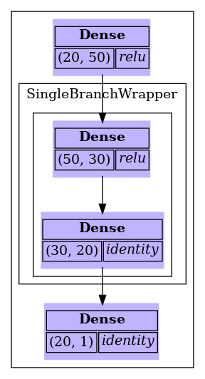
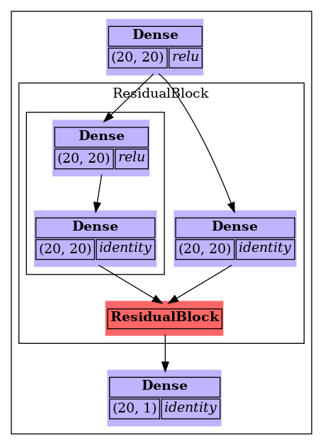
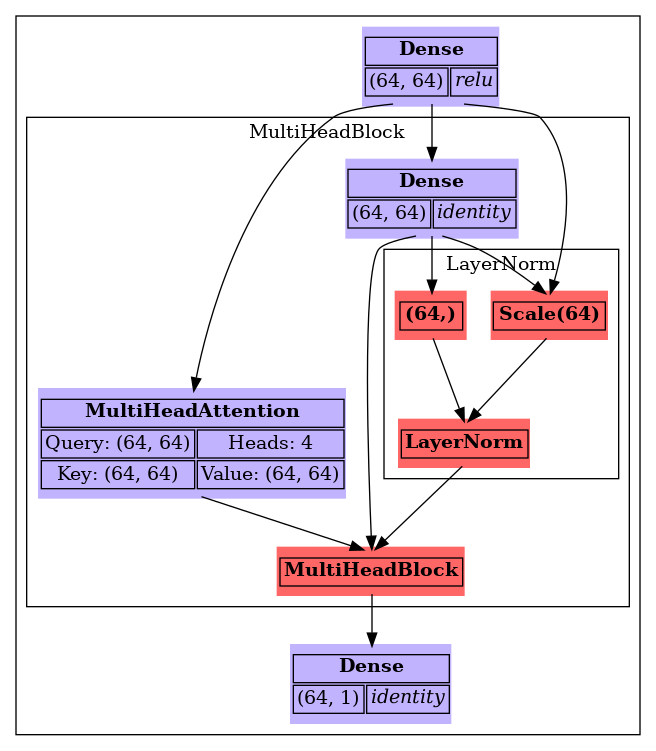
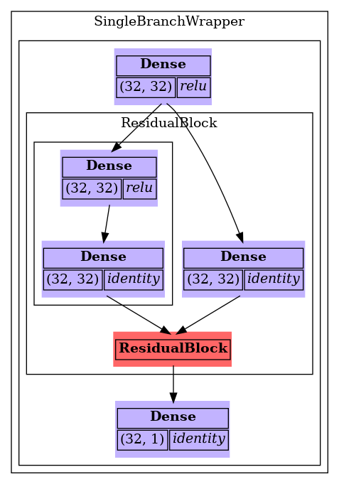

# V3.0 · NeoKCT Refactored {background-color="#1a1a2e"}

NeoKCT Progress · June 2026

---

## Last Time: Modularity Refactor "In Progress"

The June 5 meeting ended with a preview of splitting the monolith into three components:

```
NeoKCT.jl  (600+ lines, everything in one file)
    └──  KmerTable  +  CountTable  +  BiotypLayer  (planned)
```

. . .

**That refactor is now done.**
And it went further than planned.

---

## What Changed: One File, One Type

`NeoKCT.jl`, `RichKCT.jl`, `BiotypLayer.jl`, and `GenomicIndex.jl` are gone.
Everything lives in **`KCTLayers.jl`** and a single generic type:

```julia
struct KCT{K, Ab, Counts, Biotype, C <: Unsigned, D <: Unsigned}
    kmer::KmerLayer{K, Ab, C, D}   # sorted k-mers + search index
    counts::Counts                  # CountsLayer or Nothing
    biotype::Biotype                # BiotypLayer or Nothing
end
```

The four table configurations are now type-level distinctions, not separate structs:

| What it holds | Type |
|---|---|
| K-mers only (GenomicIndex) | `KCT{…, Nothing, BiotypLayer}` |
| K-mers + counts (NeoKCT) | `KCT{…, CountsLayer, Nothing}` |
| K-mers + counts + biotypes (RichKCT) | `KCT{…, CountsLayer, BiotypLayer}` |

Julia dispatches to the right `getindex`, `collapse!`, `push!` etc. at compile time (zero runtime overhead).

---

## Why This Matters

The old design had two parallel type hierarchies that had to be kept in sync manually:

```julia
# Old: every NeoKCT operation had a twin for RichKCT
Base.findfirst(rich::RichKCT, key) = findfirst(rich.kct, key)
compute_index!(rich::RichKCT; kw...) = compute_index!(rich.kct; kw...)
collapse!(rich::RichKCT) = RichKCT(collapse!(rich.kct), rich.biotypes)
# ...
```

. . .

Now there is one `push!`, one `collapse!`, one `build_kct`.
Adding a new layer type doesn't require touching any existing methods.

. . .

The `C` and `D` type parameters (checkpoint and delta word types for the `DeltaArray`) are now carried on the type rather than inferred at runtime. This fixes spurious LSP warnings and makes type inference correct throughout (making the compiler very happy :D).

---

## V3.0 File Format

The on-disk format was updated to match the new architecture.

A **layer mask byte** in the header encodes which layers are present:

```
bit 0 set → CountsLayer stored
bit 1 set → BiotypLayer stored
```

Retrocompat loaders for v1.2, v1.3, v1.4, and v2.0 files are included.
Old KCTs load and upgrade automatically.

---

# A Bug Worth Talking About {background-color="#1a1a2e"}

---

## OOM · How It Showed Up

While running tests to make sure the refactor hadn't broken anything, I fired up the production build on TCGA samples and hit an out-of-memory kill at 23% of the second sample push (50 GB SLURM allocation).

. . .

Tracking it down was a bit more involved than usual because the refactor added a layer of indirection, so there were more places to look. The two culprits turned out to be straightforward once found, and the fixes are worth explaining.

---

## OOM Fix · The Problem

Two hotspots in `push!` were allocating far more than needed:

. . .

**`find_shared_words`** scans `flat_cids` before each push to find PackedArray word IDs referenced by more than one k-mer (which can happen after `collapse!`). It was building a `Set{UInt32}` over every entry in `flat_cids`:

```julia
seen = Set{UInt32}()
shared = Set{UInt32}()
for cid in cl.flat_cids
    cid in seen ? push!(shared, cid) : push!(seen, cid)
end
```

For 100M k-mers, `seen` grows to 100M entries, roughly **4.5 GB** of temporary allocation, even though before any `collapse!` the result is always an empty set.

---

## OOM Fix · `find_shared_words`

Replaced the `Set` with a compact byte array indexed by **word ID** instead of k-mer ID.
The number of PackedArray words is bounded by the number of k-mers before collapse, and shrinks dramatically after collapse (deduplication removes redundant words).

```julia
n_words = length(cl.counts.words)
ref_counts = zeros(UInt8, n_words)   # 1 byte per word; saturate at 2
for cid in cl.flat_cids
    @inbounds ref_counts[cid] < 2 && (ref_counts[cid] += UInt8(1))
end
return Set{UInt32}(i for i in eachindex(ref_counts) if ref_counts[i] > 1)
```

The returned `Set` is the same in both versions: it only contains words actually shared, which is empty before any collapse. The saving is entirely in the intermediary: `seen` (100M entries, 4.5 GB) replaced by `ref_counts` (100M bytes, **100 MB**).

---

## OOM Fix · `ext_buf`

During `push!`, `ext_buf` tracks new PackedArray word IDs that must be appended to a k-mer's CID list when a word overflows. Previously, an empty entry was created for **every existing k-mer** upfront:

```julia
ext = get!(ext_buf, k_pos, UInt32[])  # called for every k-mer in the loop
```

For the second sample push, `missing_counts = 0` for all existing k-mers and no words overflow, so every one of those entries stays empty. With 100M existing k-mers that's millions of empty `UInt32[]` allocations and a large dict, for nothing.

. . .

Fix: **create the entry lazily**, only at the point where a word actually overflows:

```julia
# Before (always allocates)
ext = get!(ext_buf, k_pos, UInt32[])
...
last_wid != word_id && push!(ext, UInt32(word_id))

# After (allocates only on overflow)
last_wid != word_id && push!(get!(ext_buf, k_pos, UInt32[]), UInt32(word_id))
```

On the sample-2 push path (no collapse yet, no overflow), `ext_buf` stays **near-empty** throughout the entire loop.

---

# NArrays · A New Julia Package {background-color="#1a1a2e"}

---

## What Is NArrays?

`DeltaArray` and `PackedArray` started as files inside the NeoKCT repo.
They're now a **standalone Julia package**: `NArrays.jl`.

```julia
using NArrays   # DeltaArray, PackedArray, psortperm, psort!
```

. . .

They were always general-purpose data structures, the k-mer application just happened to need them first. Moving them out of NeoKCT means:

- Anyone in the lab can use them without depending on NeoKCT (Feel free to ask if you're interested!)
- They get their own versioning, documentation, and tests
- NeoKCT adds `NArrays` as a dependency like any other package

---

## DeltaArray

A sorted array that stores differences between consecutive values instead of the full values.

```julia
# Store 64-bit values with 32-bit deltas, checkpoint every 256 elements
a = DeltaArray{UInt64, UInt32}([1, 5, 6, 300, 1000])

a[3]              # → 6    (O(checkpoint_interval) random access)
for v in a        # O(1) amortised iteration
    ...
end
searchfirst(a, 300, 1, length(a))  # → 4  (forward scan from nearest checkpoint)
```

. . .

**When is this useful?**
Any large sorted list of integers where consecutive values are close together.
K-mer bit-representations (sorted) are a perfect example: consecutive values differ by ~1-10 in the 50-bit space.

At 1.15B k-mers: `Vector{UInt64}` → **9.2 GB**. `DeltaArray{UInt64,UInt16}` → **2.4 GB**.

---

## PackedArray

A bit-packed array where multiple small values share a single machine word.
Each "slot" `arr[i]` is an independent word that holds a variable number of values.

```julia
arr = PackedArray{UInt32, UInt128}()  # pack UInt32 values into 128-bit words

wid = new_word!(arr)          # allocate a fresh empty word, get its index
push!(arr, UInt32(42), wid)   # pack 42 into word wid (6 bits)
push!(arr, UInt32(0),  wid)   # pack 0 into same word (1 bit; zeros are cheap)
push!(arr, UInt32(42), wid)   # pack another value; spills to new word if full

arr[wid]   # → [42, 0, 42]   a Vector{UInt32} of everything in that word
```

. . .

**When is this useful?**
Per-sample counts across a large cohort, where most counts are small and many samples share identical count patterns (which can then be deduplicated by `permdedup`).


---

## Using NArrays in Your Own Project

```julia
] add NArrays   # available in the lab registry

using NArrays

# Delta-encode a large sorted array
positions = sort(rand(UInt64, 10_000_000))
a = DeltaArray(positions)
println(Base.summarysize(a), " vs ", sizeof(positions), " bytes")

# Parallel sort
psort!(my_vector)
perm = psortperm(my_vector)
```

If you have large sorted integer arrays or need bit-packed variable-length records, this is the package.

---

# Dabus · V3.0 {background-color="#1a1a2e"}

Network visualization for Flux models

---

## Custom `@layer` Support · Single Sublayer

Any struct decorated with `Flux.@layer` and `Flux.@functor` now renders automatically.

**One sublayer field** → inner layers wrapped in a labeled cluster.

```julia
struct SingleBranchWrapper; layers::Chain; end
Flux.@layer SingleBranchWrapper

draw_network(Chain(
    Dense(20, 50, relu),
    SingleBranchWrapper(Chain(Dense(50, 30, relu), Dense(30, 20))),
    Dense(20, 1)
))
```

{width=30% fig-align="center"}

---

## Custom `@layer` Support · Multiple Sublayers

**Multiple sublayer fields** → each becomes a parallel branch, merging at a red summary node.

```julia
struct ResidualBlock; main::Chain; skip::Dense; end
Flux.@layer ResidualBlock

draw_network(Chain(
    Dense(20, 20, relu),
    ResidualBlock(Chain(Dense(20, 20, relu), Dense(20, 20)), Dense(20, 20)),
    Dense(20, 1)
))
```

{width=35% fig-align="center"}

---

## Complex Custom Layers

More elaborate structs (multiple sublayer fields, nested custom layers, `MultiHeadAttention`, sub-clusters) all render without extra code.

{width=42% fig-align="center"}

---

## Nesting & Other V3.0 Features

Custom layers nest to any depth. Here a `SingleBranchWrapper` wraps a `ResidualBlock`:

{width=35% fig-align="center"}

. . .

- **Local GraphViz rendering** uses the `dot` binary if installed; falls back to the QuickChart.io HTTP API with a warning
- **`network_to_dot`** returns the raw DOT source string for debugging or external tools
- **`check_graphviz`** utility to verify your GraphViz installation
- **CI** GitHub Actions runs tests on every push and pull request

---

## What's Next

| Priority | Task |
|---|---|
| **Now** | Resume TCGA production build under V3.0 |
| **Near** | aeTSA extraction: join KCT against mass-spec peptide table |

---

# Questions? {background-color="#1a1a2e"}

`github.com/lemieux-lab/NeoKCT`
