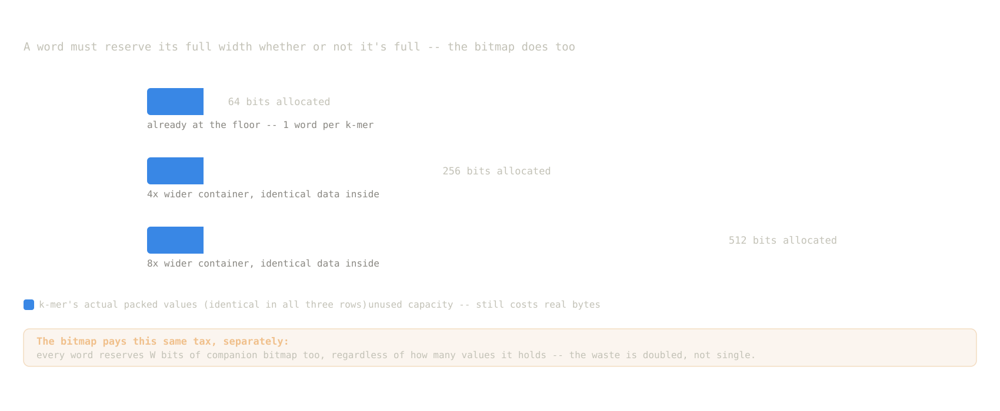
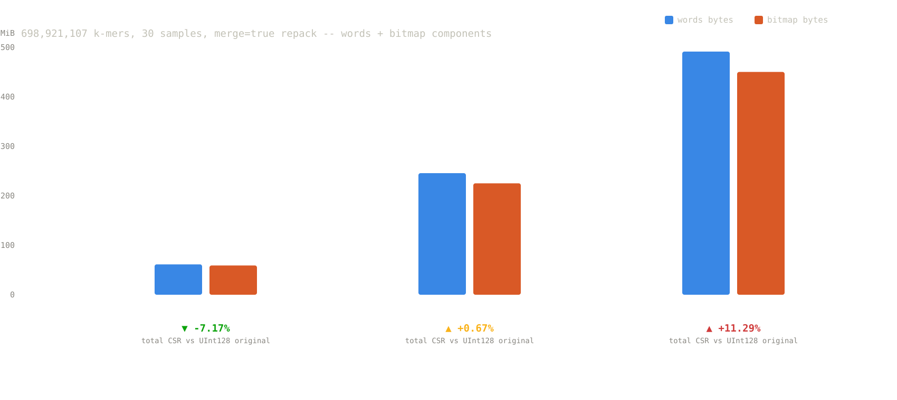

# NArrays / NeoKCT · Word-Size Tuning {background-color="#1a1a2e"}

Repack, Real Benchmarks, and Two Complexity Bugs · July 2026

---

## The Question

`PackedArray` (recap from June 25) packs per-sample counts into fixed-width machine words. Currently hardcoded at **`UInt128`** everywhere in NeoKCT.

. . .

Is `UInt128` actually the right word size for our real production table, or did we just never test the alternative?

- Bigger words → fewer words needed per k-mer, but more wasted bits when few samples share a word
- Smaller words → less waste per value, but more per-k-mer word-splitting overhead

No way to change it after the fact: the word type is baked into `PackedArray{T, W}` at construction. Needed a way to convert an existing table.

---

## Step 1 · Cheap Diagnostic Before Committing to a Rebuild

A real repack of the 7 GB production table costs ~20 minutes and tens of GB of RAM. Before spending that on every candidate `W`, wrote a standalone bin-packing simulator that predicts post-repack `flat_cids` counts from the existing table's value distribution, without needing an actual rebuild.

```
julia word_size_diagnostics.jl KCT_FILE OUT_DIR [sizes...]
```

. . .

| Candidate `W` | Predicted `flat_cids` |
|---|---|
| 64   | 699,393,091 |
| 256  | 698,923,423 |
| 512  | 698,921,145 |
| **floor** (1 word/k-mer) | **698,921,107** |

**Finding:** cid count is already within 0.0003% of the theoretical floor at `W=64`. Going bigger buys almost nothing on cid count, so it's worth checking whether it costs more than it saves elsewhere (word/bitmap bytes scale with `W`).

---

## Step 2 · Building `repack` for Real

Added to `NArrays/src/PackedArray.jl`:

```julia
function repack(arr::PackedArray{T, W1}, ::Type{W2}) where {T, W1<:Unsigned, W2<:Unsigned}
    new_arr = PackedArray{T, W2}()
    id_map = Vector{Vector{UInt32}}(undef, length(arr.words))
    for i in eachindex(arr.words)
        wid = new_word!(new_arr)
        ids = UInt32[wid]
        for v in arr[i]
            push!(new_arr, v, wid)
            if lastindex(new_arr) != wid
                wid = lastindex(new_arr); push!(ids, UInt32(wid))
            end
        end
        id_map[i] = ids
    end
    return new_arr, id_map
end
```

Splits any word whose values no longer fit under `W2`. `id_map` tracks how each old word maps onto one or more new words.

---

## Step 2 · Wiring It Into NeoKCT

`KCTLayers.jl` wraps this with two strategies:

```julia
repack(cl::CountsLayer, ::Type{W2}; merge::Bool=false, collapse::Bool=merge)
repack(kct::KCT, ::Type{W2}; merge::Bool=false, collapse::Bool=merge)
```

- **`merge=false`** (`_repack_split`): cheap, preserves existing word boundaries, can't shrink `flat_cids`
- **`merge=true`** (`_repack_merge`): consolidates each k-mer's values into fewer words. Breaks prior word-sharing, so re-runs `collapse!` by default (`collapse=merge`)

---

# Three Bugs Found Along the Way {background-color="#1a1a2e"}

---

## Bug 1 · `getindex` Was Quadratic in Word Size

`PackedArray`'s `getindex(arr, word_id)` called `get_val` once **per value in the word**, and each call re-copied and re-scanned the *entire* `W`-bit bitmap window from scratch.

```julia
# before: O(n_values · W) per word
for k in 1:n_values
    get_val(arr, word_id, k)   # re-copies the whole bitmap window every time
end
```

. . .

Harmless at `W=64`. At `W=256`/`W=512` this is exactly the hot path `repack` iterates over every word, and it turned into a real bottleneck at the sizes we most wanted to test.

**Fix:** single pass over a `@view` of the bitmap, `O(W)` total per word instead of `O(n·W)`. Also removed a full bitmap copy in `get_val` itself (view instead of copy).

---

## Bug 2 · Quadratic Accumulation via `reduce(vcat, ...)`

Two call sites built up per-k-mer value vectors with `reduce(vcat, chunks)`:

```julia
# O(m²) in values-per-k-mer m, since every vcat reallocates and recopies everything so far
reduce(vcat, [get_vals(word) for word in kmer_words])
```

Most k-mers have few values, but the ones that don't (highly-shared PackedArray words) turned this into real quadratic blowup.

. . .

**Fix:** `append!` into a preallocated accumulator, `O(m)`. Applied in `_repack_merge` and in `assemble_count_vector`.

**Flagged, not fixed:** `assemble_count_vector`'s `lo = 1 + sum(cl.n_cids[1:i-1])` is still `O(i)` per call, a real `O(n²)` risk if anything loops `kct[1:end]`. Left as an architecture decision, not touched this round.

---

## Bug 3 · `push!` Was `O(W)` Per Call, Not `O(1)`

Every `push!(arr, elem, word_id)` re-derives the word's fill pointer via `word_last_set`, a `findlast` over the **entire `W`-bit bitmap window**, even when building a word sequentially, where the caller already knows how full it is from the previous push.

```julia
# before: O(W) per push, called once per stored value across a full merge repack
last_set = word_last_set(arr, word_id)   # findlast rescan of the whole word, every time
```

. . .

That's **~12 billion calls**: one `push!` per stored value, and the table holds 11.97B of them (698.9M k-mers, up to 30 samples each, sparse in practice). Less costly at `W=64` (a 64-bit rescan), but the same rescan is 4x/8x wider at `W=256`/`W=512`, paid on every single one of those ~12 billion pushes.

---

## Bug 3 · How It Actually Failed

Real production run, `UInt256` merge repack, 150 GB SLURM allocation, `majsrv6`, job 7796965:

| | |
|---|---|
| Elapsed before kill | 1:23:57 |
| Progress reached | 33% |
| Peak RSS | 150.3 GB (hit the cgroup limit) |
| Outcome | `oom-kill` |

. . .

Slow enough that it never got close to finishing, and stayed under sustained memory pressure long enough for Julia's heap-growth heuristics to snowball RSS to the SLURM ceiling before a third of the work was done.

---

## Bug 3 · Fix

Added `push_at!`, which threads the fill pointer through explicitly instead of re-deriving it every call:

```julia
function push_at!(arr::PackedArray{T1,W}, elem::T2, word_id::Integer, last_set::Integer)
    elem, bitsize = prepack(elem, W)
    if bitsizeof(W) - last_set >= bitsize
        arr.words[word_id] |= (elem << (bitsizeof(W) - last_set - bitsize))
        update_word_bitmap!(arr, word_id, bitsize, last_set)
        return word_id, last_set + bitsize
    else
        new_id = new_word!(arr)
        return push_at!(arr, elem, new_id, 0)
    end
end
```

Wired into `_repack_merge` and the low-level `repack()`. Also dropped a redundant temp-`BitVector` allocation in `new_word!` (was allocating a whole new `W`-bit vector per word just to append it).

---

## Bug 3 · Verification & Speedup

- 500-trial fuzz test, `push_at!` vs. old `push!` path, all 4 word types (`UInt64/128/256/512`) → **0 mismatches**
- Full NeoKCT test suite → **66/66 pass**

Microbenchmark: build a `PackedArray` from scratch by pushing every value into its word one at a time, the exact operation `_repack_merge` performs per k-mer, timed old `push!(arr, elem, word_id)` vs. new `push_at!` on identical synthetic data.

A "k-mer-like group" stands in for one k-mer's own set of stored sample counts (the `vals` array in `_repack_merge`): mostly 1-5 random values (the common sparse case), occasionally 10-30 (the dense, fully-merged case), mirroring the real table's mix. 2M such groups, 12.8M values total (summed across all groups, one `push!` per value):

| `W` | old | new | speedup |
|---|---|---|---|
| `UInt64` | 1.55s | 0.56s | **2.8×** |
| `UInt256` | 3.97s | 0.62s | **6.4×** |
| `UInt512` | 7.51s | 0.74s | **10.1×** |

Speedup scales with `W`, exactly as the `O(W) → O(1)` diagnosis predicts.

---

## Verification Before Trusting Any of This on Production Data

Same discipline, applied earlier to Bug 1 and Bug 2's fixes (the test-suite pass count above already covers these):

- 500-trial fuzz test for **Bug 1**: new vs. pre-fix reference `getindex`/`get_val`, all 5 word types → **0 mismatches**
- 6-way repack round-trip (3 word sizes × merge on/off) on synthetic KCT → all correct
- Old-vs-new repack, byte-identical comparison on a 150K k-mer synthetic table
- Real production repack (`UInt64`): 51,998 k-mers spot-checked via precomputed offsets → all match

---

## Real Benchmark · Production Table, `UInt128 → UInt64`

30-sample TCGA table: **698,921,107 k-mers**, **11.97B stored values**, 7 GB on disk.

Load: **134.0 s** · `repack(kct, UInt64; merge=true)`: **1103.1 s** (~18.4 min) · peak RSS **75.1 GB** (150 GB SLURM allocation, comfortable headroom)

| | `flat_cids` | `n_cids` | `words` | `bitmap` | **total** |
|---|---|---|---|---|---|
| **Before** (`UInt128`) | 813,710,396 (3.031 GiB) | 1.302 GiB | 88,499 (1.35 MiB) | 1.35 MiB | **4.336 GiB** |
| **After** (`UInt64`) | 699,393,091 (2.605 GiB) | 1.302 GiB | 7,744,460 (61.4 MiB) | 59.1 MiB | **4.025 GiB** |
| Δ | **−14.05%** | n/a | **+8650%** | **+4276%** | **−7.17%** |

. . .

Smaller `W` normally means *more* splitting, so a smaller `flat_cids` looks backwards. But "Before" isn't just "the same layout in bigger words": it's the table as incrementally built (`push!` + periodic `collapse!`), which fragments each k-mer's values across whatever words happen to be shared at the time. `merge=true` actively repacks each k-mer's *whole* value set into as few fresh words as possible, and Step 1's sweep already showed that data fits under 64 bits, so there's no extra splitting to pay for. The `flat_cids` drop is the effect of merging, not of a smaller `W`.

---

## Key Finding · Where the Naive Number Lies to You

`flat_cids` alone says −14%. Net total only moved **−7.17%**, less than half that. Why:

. . .

`collapse!` dedups identical words. Original sparse words (median ~2 values) get shared **~9,195×**. Merged dense words (30 values each, one per sample) only collapse together if **all 30** samples match exactly across two k-mers, so sharing drops to **~90×**.

**`merge=true` trades `flat_cids` savings for word-level sharing loss.** The two effects partially cancel; the net win is real but much smaller than the headline number suggests.

---

## Does Going Bigger Ever Pay Off? · Hypothesis Confirmed

The diagnostic sweep predicted `flat_cids` is already ~99.9997% of its floor by `W=64`, so `W=256`/`W=512` should buy almost nothing there, while `words`/`bitmap` bytes scale roughly linearly with `W`.

First attempt at this benchmark is what surfaced **Bug 3** (`push!`'s `O(W)` rescan): it OOM'd at 33% progress before producing a single number. Fixed and relaunched as two independent jobs, sized up from the 150 GB that failed. Both completed overnight:

| Job | `W` | Mem | Elapsed |
|---|---|---|---|
| 7797993 | `UInt256` | 300 GB | 21m39s |
| 7797994 | `UInt512` | 400 GB | 33m12s |

(vs. the pre-fix attempt's 84 minutes to reach only 33%; post-fix, both finished faster than that alone.) 51,998 k-mers spot-checked for both, all match.

---

## Why Bigger Words Don't Help Here

{fig-align="center" width="92%"}

---

## Full Word-Size Comparison

| | `UInt64` | `UInt256` | `UInt512` |
|---|---|---|---|
| `flat_cids` | 699,393,091 (2.605 GiB) | 698,923,423 (2.604 GiB) | 698,921,145 (2.604 GiB) |
| `words` | 7,744,460 (61.4 MiB) | 7,379,274 (245.7 MiB) | 7,377,135 (491.5 MiB) |
| `bitmap` | 59.1 MiB | 225.2 MiB | 450.3 MiB |
| **Total CSR** | **4.025 GiB** | **4.365 GiB** | **4.825 GiB** |
| **vs. original (4.336 GiB)** | **−7.17%** | **+0.67%** | **+11.29%** |
| Repack time / peak RSS | 1103s / 75.1 GB | 1181s / 133.8 GB | 1929s / 226.3 GB |

. . .

**Hypothesis confirmed, and it gets worse with scale.** cid count barely moves past the `W=64` floor (14.11% fewer either way, same as `UInt64`'s 14.05%), while `words`+`bitmap` bytes keep growing with `W`. `UInt256` is a wash; `UInt512` is outright worse than the original `UInt128` table. Peak memory scales the same way: 75 → 134 → 226 GB.

**`UInt64` remains the best word size found**: bigger buys nothing on cid count and costs real bytes and RAM.

---

## Same Data, Visualized

{fig-align="center" width="92%"}

---

---

# GTEX K-mer Table · Reusing Precomputed Jellyfish Dumps {background-color="#1a1a2e"}

Why GTEX, why not the raw FASTQs, and what breaks when you reuse someone else's Jellyfish output · July 2026

---

## Why GTEX, and Why Now

Want to benchmark the full NeoKCT pipeline against **BAMQuery**, which validated on **2,000+ GTEx samples**.

. . .

To make that comparison meaningful, need a GTEX table at matching scale, not a token subset. `/home/golem/GTEX` has **2,489 samples across 50 tissues**, close to BAMQuery's cohort size.

---

## The Catch: No Raw FASTQs

GTEx raw reads are dbGaP-controlled access, not sitting on disk here. What *is* available at `/home/golem/GTEX` per sample:

- `<SRR>.cram` (aligned, not raw reads)
- `<SRR>.24.trimmed.jf`: a **pre-computed Jellyfish binary dump**, built once, a while ago, by someone else's pipeline (`/home/golem/GTEX/bin/jellyfish.sh`)

. . .

No raw reads → can't run `jello_superthreaded_hash` (our normal FASTQ → k-mer path). Have to parse Jellyfish's own binary dump format directly instead.

---

## Reviving an Old Parser

`src/JellyfishDump.jl` (new): parses Jellyfish's binary/sorted dump format (`<offset>{JSON header}<packed records>`) and translates each DNA k-mer to its amino-acid k-mer, same single-frame `translate` as the live path.

. . .

Adapted from an **older personal parser** for this exact binary format, written and validated against real Jellyfish output in an earlier NeoKCT version. The record math (packed-vs-separate branch, shift amounts) is unchanged from that version, just hardened:

- `verify_jellyfish_dump`: spot-checks parsed records against `jellyfish dump -c` CLI output before trusting a full parse
- 500+ synthetic-dump unit tests

---

## Problem 1 · Wrong K-mer Length

`/home/golem/GTEX/bin/jellyfish.sh` built every dump with:

```
jellyfish count -m 24 --disk -C ...
```

`-m 24` → 24bp DNA k-mers → **8-mer peptides**. TCGA's pipeline uses `K=30` → **10-mer peptides**.

. . .

`KCT{K, Ab, ...}` is parameterized on `K`, so a `KCT{8,...}` and a `KCT{10,...}` are different types entirely and samples can't be pushed between them. Smaller than it sounds though: a full BAMQuery comparison only actually needs one TCGA subset at matching k-mer length, not the whole cohort.

**Decision:** GTEX stays its own `KCT{8, AAAlphabet}` table. Where matching length actually matters, rebuild just the TCGA DLBC subset (~40-something samples) at `K=24`; everything else compares at the peptide level after both are built.

---

## Problem 2 · Canonical Counting

Same `jellyfish.sh` also passed `-C` (canonical counting) for every one of the 2,489 dumps, checked directly against several tissues' headers to confirm it's not a per-batch fluke.

. . .

A canonical k-mer's stored bit pattern can come from **either strand**. Translating it in one fixed reading frame silently produces the **wrong peptide for roughly half the k-mers**, so `JellyfishDump.jl` refuses canonical dumps by default for exactly this reason (`allow_canonical=false` → error).

**Decision:** proceed anyway with `allow_canonical=true`. Raw reads to re-derive strand-correct counts don't exist locally, and the BAMQuery-style comparison is the priority, accepting the mistranslation risk on GTEX (not on TCGA, which is unaffected).

---

## Real Cost, Measured on One Sample

Smoke-tested end to end on `lung/SRR1310520` before trusting the pipeline on all 2,489 samples:

| | Count |
|---|---|
| DNA 24-mers parsed | 153,489,791 |
| → unique AA 8-mers | 55,792,766 |
| **Dropped (in-frame stop codon)** | **38,860,551 (25%)** |

Confirms the canonical/single-frame cost isn't theoretical: a quarter of k-mers are lost to stop codons on a single real sample, on top of the (unmeasurable without ground truth) mistranslated fraction from Problem 2.

---

## Mapping Counts Back to Samples

A `KCT` doesn't store sample names, insertion order **is** the sample index (CID). Needed an explicit lookup, since GTEX samples nest one extra directory level for some tissues (brain sub-regions) that broke a naive path-depth assumption.

```
index   sample_id    tissue                  jf_path
1       SRR599313    adipose_subcutaneous    /home/golem/GTEX/adipose_subcutaneous/...
...
663     SRR1072367   brain_frontal_cortex    /home/golem/GTEX/brain_frontal_cortex/SRR821602/SRR1072367/...
```

`gen_gtex_samples.sh` generates this (`gtex_samples.tsv`) plus the ordered path list (`gtex_jf.paths`) consumed by the build, mirroring `tcga_fastqs.paths`.

---

## Pipeline, Mirroring the TCGA Slurm Build

`build_kct_gtex.sh` / `incremental_kct_step_gtex.jl` mirror `build_kct_tcga.sh` / `incremental_kct_step.jl` exactly, swapping the per-sample step:

```julia
# TCGA: ht = jello_superthreaded_hash(fastq_path, K, CHUNKS)
# GTEX:
ht = jellyfish_dump_hash(jf_path; allow_canonical=true)
kct = KCT{8, AAAlphabet}(ht, word_size=UInt128)
```

Same batch/resume/seed-KCT Slurm logic. Memory formula lowered to **2 GB/sample** (floored at 10 GB), vs. TCGA's 5 GB/sample, since GTEX dumps are already-deduplicated unique-kmer sets, not raw reads, so per-sample footprint should be lighter.

---

## Status

- End-to-end smoke test (parse real `.jf` → build `KCT{8,...}`) passed
- Full build (2,489 samples, target scale to match BAMQuery) launching now, 30 CPUs/job:

```
./build_kct_gtex.sh /u/jacquinn/phd_stuff/data/neo_kcts/production/GTEX_V1.0 \
    /u/jacquinn/phd_stuff/data/gtex_jf.paths --cpus 30
```

---

## What's Next

| Priority | Task |
|---|---|
| **Done** | Word-size sweep complete: `UInt64` confirmed as the production word size |
| **Now** | Launch full GTEX build (2,489 samples, 30 CPUs/job) |
| **Near** | Resolve `assemble_count_vector`'s `O(i)` lookup if any workflow needs full-table iteration |
| **Near** | Compare pipeline against BAMQuery on the GTEX cohort once built |

---

# Questions? {background-color="#1a1a2e"}

`github.com/lemieux-lab/NeoKCT`
