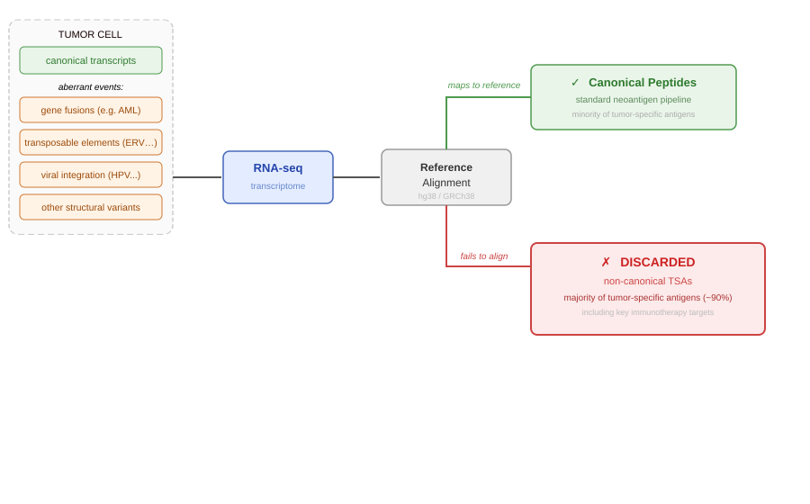
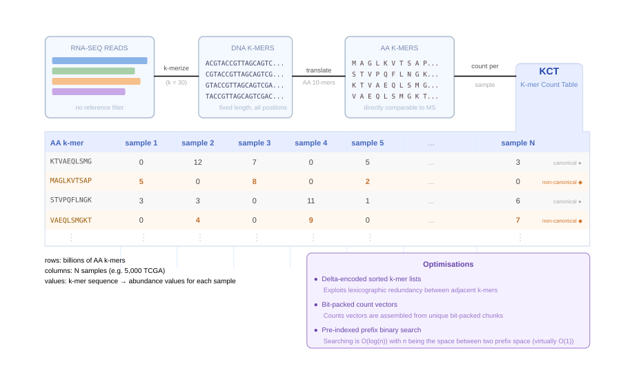
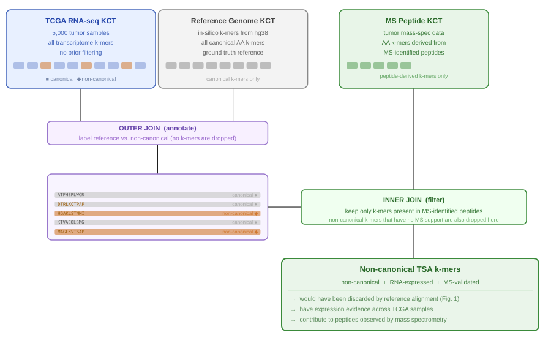
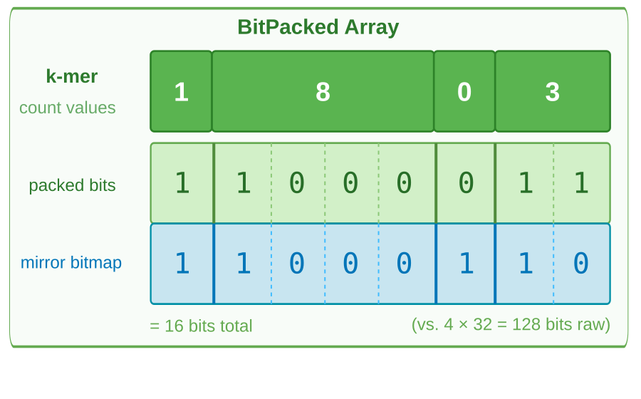

## The Problem {.center}

:::: {.columns}

::: {.column width="65%"}

:::

::: {.column width="35%"}
Reference alignment **discards non-aligning reads**.

Non-canonical TSAs (ERVs, gene fusions, alternative ORFs, and other aberrant events) **fail to align** and are lost.

Yet non-canonical regions are the **dominant source** of tumor-specific antigens (~90%) [@laumont2018; @cuevas2021].
:::

::::

---

## The Approach {#the-approach .center}

  

::: {.absolute bottom="20px" right="20px" style="display: flex; gap: 8px;"}
<a href="#delta-detail" style="background: rgba(230,220,255,0.95); border: 1px solid rgb(153,119,204); border-radius: 4px; padding: 4px 10px; font-size: 14px; color: rgb(102,68,170); text-decoration: none; cursor: pointer;">Delta encoding ↗</a>
<a href="#bitpack-detail" style="background: rgba(230,220,255,0.95); border: 1px solid rgb(153,119,204); border-radius: 4px; padding: 4px 10px; font-size: 14px; color: rgb(102,68,170); text-decoration: none; cursor: pointer;">BitPacked encoding ↗</a>
:::

---

## The Query {.center}

{width="90%" fig-align="center"}

---

## {.center}

*Supplementary*

---

## BitPacked Encoding {#bitpack-detail .center}

::: {.absolute bottom="20px" left="20px"}
<a href="#the-approach" style="background: rgba(230,220,255,0.95); border: 1px solid rgb(153,119,204); border-radius: 4px; padding: 4px 10px; font-size: 14px; color: rgb(102,68,170); text-decoration: none; cursor: pointer;">↙ Back</a>
:::

:::: {.columns}

::: {.column width="65%"}
{width="100%"}
:::

::: {.column width="35%"}
Each k-mer's count vector is stored as a **packed bits** row plus a **mirror bitmap** that marks the bit-width boundaries.

**Why this saves space**

Most counts are very low (0, 1, 2...), so a 2-bit or 4-bit slot is enough per sample. Even paying for the extra mirror bitmap is cheaper than one `UInt32` per count.

Fixed-size packed **chunks** are reused across k-mers: as more samples are added, the pool of distinct chunks grows slowly while the number of k-mers that share the same chunk grows fast. A naive per-k-mer `Vector{UInt32}` would become increasingly unique and never benefit from that deduplication.
:::

::::

---

## Delta Encoding {#delta-detail .center}

::: {.absolute bottom="20px" left="20px"}
<a href="#the-approach" style="background: rgba(230,220,255,0.95); border: 1px solid rgb(153,119,204); border-radius: 4px; padding: 4px 10px; font-size: 14px; color: rgb(102,68,170); text-decoration: none; cursor: pointer;">↙ Back</a>
:::

  

## References {.unnumbered}

::: {#refs}
:::
